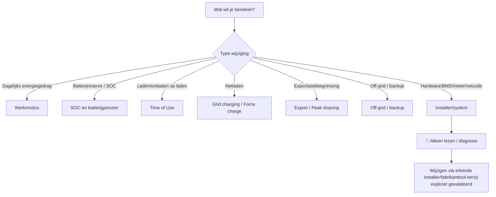
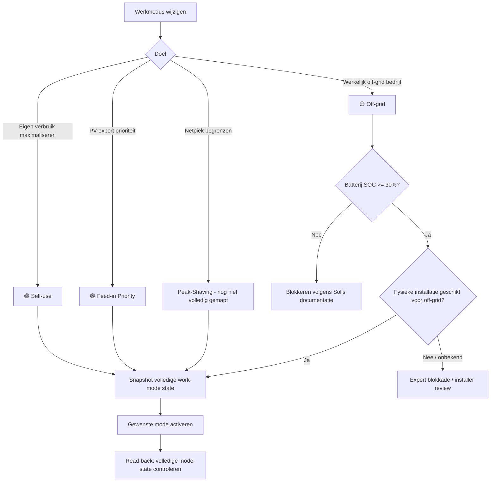
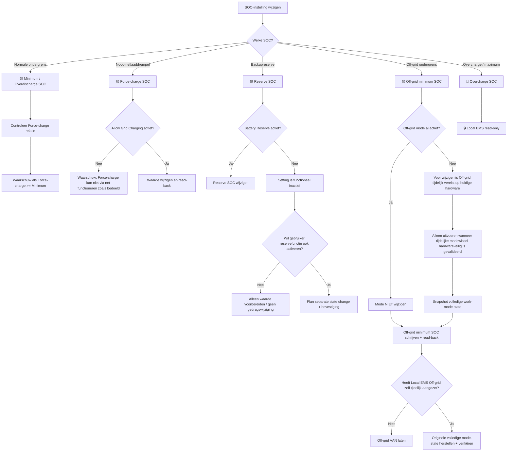
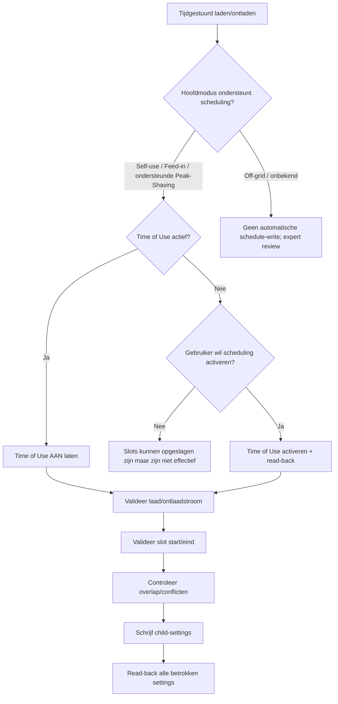
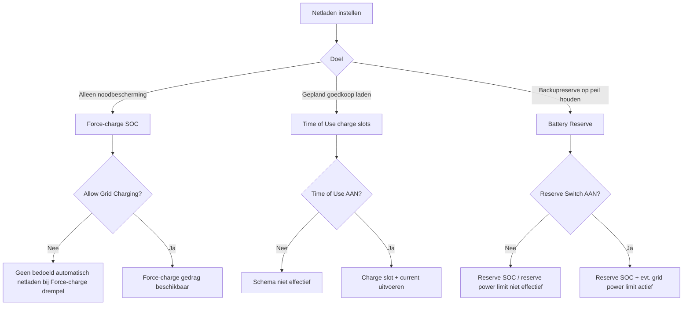
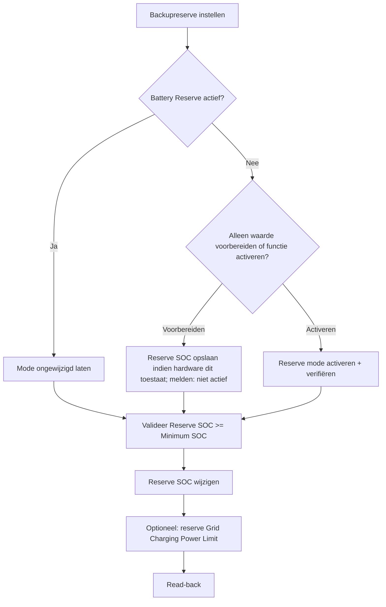
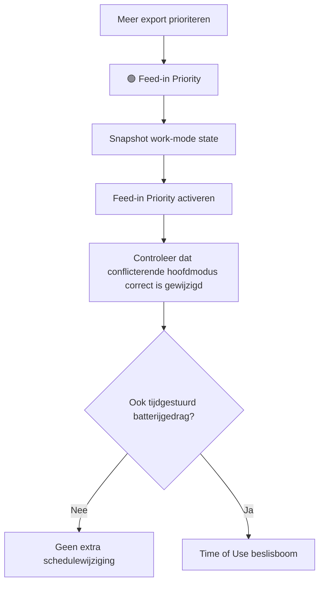
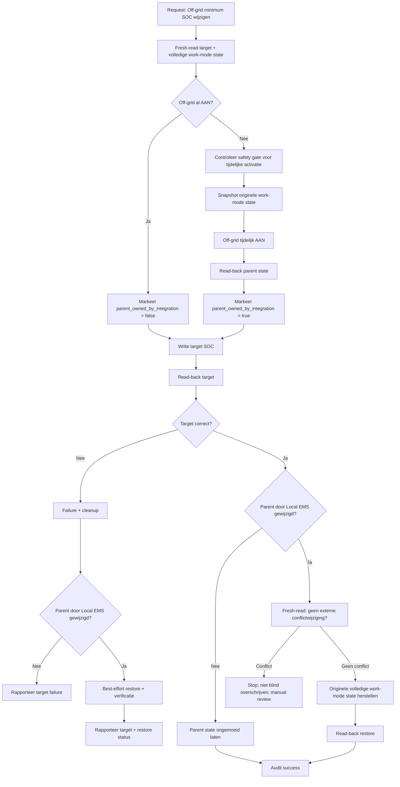
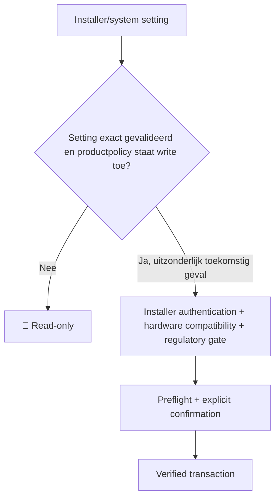

# Settings Decision Tree — Autarco Local / Local EMS

> **Doel:** deze pagina is de levende functionele specificatie voor settings-bediening. De gebruiker kiest wat hij wil bereiken; de software bepaalt welke settings, afhankelijkheden en veiligheidschecks nodig zijn.
>
> Deze beslisboom is bewust strenger dan de fabrikant-UI. Een expert krijgt méér context, niet minder bescherming.

## Statuslegenda

### Toegangsniveau

- 🟢 **Standard** — geschikt als normale eindgebruikerinstelling nadat de write-route gevalideerd is.
- 🟡 **Expert** — alleen met context, preflight, waarschuwing en expliciete bevestiging.
- 🔴 **Installer/system** — zichtbaar voor diagnose, maar in Local EMS standaard hard read-only.

### Bewijsniveau

- ✅ **HW** — op de ondersteunde Autarco/Solis hardware waargenomen/gevalideerd.
- 📘 **DOC** — officieel door Solis/Autarco gedocumenteerd.
- 🧪 **TEST** — relatie is aannemelijk of gedocumenteerd, maar write-volgorde moet nog op hardware worden gevalideerd.
- 🔒 **LOCK** — niet schrijven totdat mapping/schaal/safety is bewezen.

### Soorten afhankelijkheid

| Code | Type | Betekenis |
| --- | --- | --- |
| **W** | Write prerequisite | Parent state moet actief zijn om de child-setting überhaupt te kunnen wijzigen. |
| **E** | Effect prerequisite | Setting kan mogelijk worden opgeslagen, maar heeft pas functioneel effect als de parent actief is. |
| **S** | Safety relation | Waarden beïnvloeden elkaars veilige/logische bereik. |
| **X** | Mutual exclusion | Modi mogen niet gelijktijdig actief zijn; activeren kan andere mode uitschakelen. |
| **H** | Hardware/config prerequisite | Vereist passend batterijtype, bedrading, meter of fysieke installatie. |
| **R** | Restore rule | Alleen state die Local EMS zelf tijdelijk wijzigde mag automatisch worden hersteld. |

---

# 1. Master decision tree



De software moet dus niet starten met “welk register?”, maar met **“welk doel?”**.

---

# 2. Werkmodi: eerst de hoofdmodus bepalen

Solis documenteert Self-use, Feed-in Priority, Peak-Shaving en Off-grid als afzonderlijke work modes. Self-use kan niet gelijktijdig actief zijn met de andere genoemde modi; bij activering van een andere mode kan Self-use automatisch worden uitgeschakeld. Daarom behandelen we het work-mode register als één samenhangende state en niet als losse onafhankelijke bits. **X + R, 📘 DOC.**



### Regels

- **Self-use ↔ Feed-in Priority ↔ Peak-Shaving ↔ Off-grid:** behandelen als onderling exclusieve hoofdmodi. **X, 📘 DOC.**
- Bij iedere mode-write: volledige relevante mode-state pre-read en post-read.
- Nooit aannemen dat alleen het gekozen bit verandert.
- Als Local EMS voor een child-setting tijdelijk een andere mode nodig heeft, geldt altijd **Original State Wins**.

---

# 3. SOC- en batterijbeslisboom



## SOC-relaties

### 🟡 Minimum / Overdischarge SOC — register 43011

- Normale ontlaadondergrens van de batterij. **📘 DOC.**
- Geen parent mode nodig om de betekenis te hebben.
- **S:** Force-charge SOC hoort functioneel onder de normale minimumgrens te liggen zodat er een noodbuffer bestaat tussen “stop normaal ontladen” en “start geforceerd laden”. De huidige code behandelt `Force-charge >= Minimum` bewust nog als **CHECK**, niet als bewezen hard protocolverbod.
- Wijziging kan invloed hebben op beschikbare batterijcapaciteit, backupgedrag en ECO/herstelgedrag.

### 🟡 Force-charge SOC — register 43018

- Drempel waarbij de inverter de batterij via het net kan gaan bijladen. **📘 DOC.**
- **E:** Solis adviseert/vereist voor bedoeld netlaadgedrag dat **Allow Grid Charging** actief is.
- **S:** vergelijken met Minimum/Overdischarge SOC.
- **E:** Battery Healing gebruikt Force-charge SOC als triggerpunt in de officiële documentatie.

### 🟢 Reserve SOC — register 43024

- Backupreserve voor netuitval. **📘 DOC.**
- **E:** alleen actief/effectief wanneer **Battery Reserve Switch** aan staat.
- Officiële SolisCloud-documentatie geeft 10–100% als bereik; lokale app/documentatie kan model/firmware-afwijkingen hebben, dus de driver gebruikt pas een schrijfbereik na hardwarevalidatie.
- Bestaande Local EMS safety policy: `Reserve SOC >= Minimum battery SOC`.
- Reserve SOC is **niet** hetzelfde als Force-charge SOC en **niet** hetzelfde als Off-grid minimum SOC.

### 🟡 Off-grid minimum SOC — register 43137

- Minimum-SOC tijdens off-gridbedrijf. **📘 DOC.**
- **W, ✅ HW:** op de huidige Autarco LH-MII lokale Installer-UI wordt deze setting pas beschikbaar nadat Off-grid mode is aangezet.
- **R, ✅ HW-principe:** als Off-grid vóór de transactie al AAN stond, blijft hij AAN; alleen een door Local EMS tijdelijk aangezette mode mag worden hersteld.
- **H, 📘 DOC:** Solis beschrijft Off-grid als bedoeld voor een passende off-gridconfiguratie en documenteert dat de mode niet geactiveerd kan worden onder 30% SOC. Automatisch tijdelijk activeren op een grid-connected installatie blijft daarom een aparte hardware-safety gate.

### 🔴 Overcharge SOC — register 43010

- Beschermings-/maximumparameter.
- **LOCK:** zichtbaar, maar niet schrijfbaar vanuit Local EMS.

---

# 4. Time-of-Use en tijdsloten



### Dependencies

- 🟢 **Time-of-Use mode** — register 43110 bit 1.
- 🟡 **Scheduled charge current** — 43141, raw × 0.1 A.
- 🟡 **Scheduled discharge current** — 43142, raw × 0.1 A.
- 🟢 **Charge slots 1–3** — 43143–43146, 43153–43156, 43163–43166.
- 🟢 **Discharge slots 1–3** — 43147–43150, 43157–43160, 43167–43170.

**E, 📘 DOC:** laad-/ontlaadtijden zijn alleen effectief wanneer Time of Use is ingeschakeld. De lokale gids koppelt Time of Use ook aan de instelbare laad-/ontlaadstroom.

### Transaction policy

- Als Time of Use al AAN staat: nooit na een slotwijziging uitzetten.
- Als alleen een tijdslot wordt aangepast terwijl Time of Use UIT staat: UI moet expliciet vragen of de gebruiker ook scheduling wil activeren; niet stilletjes activeren.
- Een expert kan dus bewust een toekomstig schema voorbereiden zonder het meteen actief te maken.
- Automatisch tijdelijk togglen van Time of Use alleen na hardware-writevalidatie.

### Nog te valideren schedulerregels

- maximaal aantal door deze generatie ondersteunde slots;
- betekenis van `00:00–00:00` per firmware;
- overlap tussen charge en discharge slots;
- prioriteit wanneer meerdere slots elkaar raken;
- gedrag bij zomertijd/RTC-wijziging;
- huidige limieten voor laad-/ontlaadstroom vanuit BMS versus ingestelde schedule-current.

---

# 5. Grid charging / Force charge



### Belangrijke scheiding

**Force-charge**, **scheduled grid charging** en **Battery Reserve** zijn drie verschillende doelen. De UI mag ze niet onder één generieke “minimum SOC”-slider verstoppen.

### 🟡 Allow Grid Charging — register 43110 bit 5

- Bepaalt of netenergie voor batterijcharging gebruikt mag worden. **📘 DOC.**
- **E:** relevant voor Force-chargegedrag.
- Expert-setting omdat inschakelen direct invloed kan hebben op netimport/kosten.

### 🟡 Force-charge power limit — huidig kandidaat-register 43027

- **🔒 LOCK.** De huidige mapping/schaal is niet betrouwbaar genoeg: Home Assistant toonde eerder 1.000 W terwijl de officiële lokale Installer-UI 10.000 W toont.
- Officiële Solis-documentatie koppelt “Max Grid Power when Force Charge” aan de battery-level peak-shaving setting. **E, 📘 DOC.**
- Niet verwarren met de afzonderlijke **Work Mode Peak-Shaving**.
- Pas schrijfbaar na validatie van register, scaling, range en parent switch.

---

# 6. Battery Reserve



### Dependencies

- 🟢 **Reserve Battery mode** — 43110 bit 4.
- 🟢 **Reserve SOC** — 43024.
- toekomstige **Reserve Grid Charging Power Limit** — officiële setting, register nog niet gevalideerd.

**E, 📘 DOC:** Reserved SOC en de bijbehorende grid-charging power limit zijn alleen effectief wanneer Battery Reserve aan staat.

**S:** Local EMS houdt `Reserve SOC >= Minimum battery SOC` als beschermingsregel totdat hardware/documentatie aanleiding geeft dit model te verfijnen.

---

# 7. Feed-in Priority



- **X, 📘 DOC:** behandelen als exclusieve hoofdmodus ten opzichte van Self-use/Off-grid/Peak-Shaving.
- Solis documenteert dat Feed-in Priority ook charge/discharge scheduling, Allow Grid Charging en Battery Reserve kan combineren.
- Daarom horen Time-of-Use en Reserve niet automatisch uitgeschakeld te worden wanneer naar Feed-in Priority wordt gewisseld; de **volledige gewenste eindstate** moet vooraf worden getoond.

---

# 8. Peak-Shaving: twee verschillende concepten

Er zijn twee termen die in de fabrikant-UI/documentatie sterk op elkaar lijken en daarom expliciet uit elkaar moeten blijven.

## A. Work Mode Peak-Shaving

- afzonderlijke hoofdmodus;
- alleen ondersteund met communicerende lithiumbatterij volgens Solis;
- Max Usable Grid Power;
- Baseline SOC;
- Allow Grid Charging;
- kan Time of Use ondersteunen.

**Status Local EMS:** nog niet volledig gemapt; geen writes.

## B. Battery-level Peak Shaving Setting / Max Grid Power when Force Charge

- bepaalt dynamische begrenzing van grid power tijdens Force Charge;
- officiële lokale app toont hiervoor een aparte switch en vermogenswaarde;
- huidige kandidaatmapping van de powerwaarde is inconsistent.

**Status Local EMS:** 🔒 LOCK totdat switch-register, power-register en scaling hardwarematig zijn bewezen.

---

# 9. Off-grid child-setting transaction — exacte state-regel

Dit is de referentie voor alle toekomstige dependent writes.



**Cruciale regel:** een reeds actieve parent mode is eigendom van de gebruiker/installatie, niet van de transactie.

---

# 10. Complete dependency matrix van de huidige Autarco Local settings

| Setting | Level | Register | Belangrijkste dependencies | Type | Status |
| --- | --- | ---: | --- | --- | --- |
| Overcharge SOC | 🔴 | 43010 | batterij/BMS profiel | H/S | 🔒 read-only |
| Minimum / Overdischarge SOC | 🟡 | 43011 | Force-charge relatie; ECO/hysteresis beïnvloed | S/E | 📘 + 🧪 |
| Force-charge SOC | 🟡 | 43018 | Allow Grid Charging voor bedoeld netlaadgedrag | E | 📘 DOC |
| Reserve SOC | 🟢 | 43024 | Battery Reserve ON; >= Minimum SOC policy | E/S | 📘 + policy |
| Force-charge power limit | 🟡 | 43027 kandidaat | battery peak-shaving setting; scaling onbekend | E | 🔒 LOCK |
| Self-use | 🟢 | 43110 bit 0 | andere hoofdmodi exclusief | X/R | 📘 DOC |
| Time of Use | 🟢 | 43110 bit 1 | ondersteunde work mode; slots/currents hangen ervan af | E | 📘 DOC |
| Off-grid mode | 🟡 | 43110 bit 2 | SOC >=30% volgens docs; fysieke off-grid geschiktheid | H/S/X | 📘 + 🧪 |
| Reserve Battery mode | 🟢 | 43110 bit 4 | activeert Reserve SOC/power-limit effect | E | 📘 DOC |
| Allow Grid Charging | 🟡 | 43110 bit 5 | Force-charge/reserve/schedule context | E | 📘 DOC |
| Feed-in Priority | 🟢 | 43110 bit 6 | andere hoofdmodi exclusief | X/R | 📘 DOC |
| Off-grid minimum SOC | 🟡 | 43137 | Off-grid ON vereist voor edit op huidige hardware | W/E/R | ✅ HW + 📘 |
| Scheduled charge current | 🟡 | 43141 | Time of Use ON voor effect; BMS/inverter current caps | E/S | 📘 + 🧪 |
| Scheduled discharge current | 🟡 | 43142 | Time of Use ON voor effect; BMS/inverter current caps | E/S | 📘 + 🧪 |
| Charge slot 1 | 🟢 | 43143–43146 | Time of Use ON voor effect | E | 📘 DOC |
| Discharge slot 1 | 🟢 | 43147–43150 | Time of Use ON voor effect | E | 📘 DOC |
| Charge slot 2 | 🟢 | 43153–43156 | Time of Use ON voor effect | E | 📘 DOC |
| Discharge slot 2 | 🟢 | 43157–43160 | Time of Use ON voor effect | E | 📘 DOC |
| Charge slot 3 | 🟢 | 43163–43166 | Time of Use ON voor effect | E | 📘 DOC |
| Discharge slot 3 | 🟢 | 43167–43170 | Time of Use ON voor effect | E | 📘 DOC |

---

# 11. 🔴 Installer/system branch

Deze instellingen zijn relevant voor de beslisboom omdat andere settings ervan afhankelijk kunnen zijn, maar ze worden **niet automatisch schrijfbaar** doordat we hun relatie begrijpen.



### Huidige red/unmapped categorieën

- Grid standard / grid code
- Grid voltage protection limits
- Grid frequency protection limits
- Anti-islanding / CERT / DRM gerelateerde parameters
- Meter type en meterfunctie
- CT-richting
- Battery Select / batterijmodel
- Battery communication/profile parameters
- Modbus address
- Factory calibration
- Firmware/service parameters

### Belangrijkste dependencyprincipes

- **Battery Select → alle battery current/SOC logica.** Verkeerd batterijprofiel kan BMS-communicatie en veilige limieten ongeldig maken. 🔒
- **Meter type / CT-richting → exportlimit, peak shaving, grid power en EMS-logica.** Verkeerde meetrichting kan de regelkring omkeren. 🔒
- **Grid code → protection/voltage/frequency/reactive-power settings.** Netcodewijzigingen zijn regulatoir/safety relevant. 🔒
- **Modbus address → communicatie.** Geen normale gebruikerssetting.
- **Factory calibration / firmware → service-domain.** Nooit onderdeel van automatische energie-optimalisatie.

---

# 12. Officiële settings die nu zichtbaar zijn maar nog niet volledig in de catalogus zitten

Deze worden apart geïnventariseerd voordat ze een definitief groen/geel/rood niveau krijgen.

| Setting | Bekende relatie | Voorlopige policy |
| --- | --- | --- |
| Max charge current | begrensd door inverter + batterij/BMS | 🔴/🟡 kandidaat; eerst batterijcompatibiliteit valideren |
| Max discharge current | begrensd door inverter + batterij/BMS | 🔴/🟡 kandidaat; eerst batterijcompatibiliteit valideren |
| Overdischarge hysteresis SOC | recovery rond Overdischarge SOC | 🟡 kandidaat; relatie exact hardwaretesten |
| Battery Healing switch | gebruikt Force-charge SOC als trigger | 🟡/🔴 kandidaat |
| Battery Healing SOC | alleen relevant met Healing actief | E; 🟡/🔴 kandidaat |
| Battery-level Peak Shaving setting | parent van force-charge grid-powerlimiet | 🟡 kandidaat, mapping zoeken |
| ECO function | gebruikt Overdischarge/Force-charge gedrag | 🟡 kandidaat; effect goed uitleggen |
| Manual Battery Wake-up | direct servicecommando | 🔴 kandidaat |
| Auto Battery Wake-up | wake-condities/voltage/time | 🔴/🟡 kandidaat |
| Work Mode Peak-Shaving | lithium + meter + grid-power parameters | 🟡 kandidaat; nog volledig mappen |
| Peak-Shaving Max Usable Grid Power | Work Mode Peak-Shaving | E |
| Peak-Shaving Baseline SOC | Work Mode Peak-Shaving | E |
| Feed-in Power Limit | meter/CT + export-limit switch | 🟡/🔴 kandidaat |
| Feed-in Current Limit | meter/CT + current-limit switch | 🟡/🔴 kandidaat |
| FailSafe | meter/communication/export control | 🔴 kandidaat |
| Backup port enable/voltage | fysieke backupbedrading | 🔴 kandidaat |
| AC Coupling controls | fysieke AC-coupled installatie; no-grid/no-generator condities | 🔴 kandidaat |
| Generator controls | generatorhardware / SOC thresholds | 🔴 kandidaat |

**Geen van deze regels verleent write-permissie.** Eerst mapping, range, dependencies en hardwaretest.

---

# 13. Expert UX: preflight in gewone taal

Voor iedere wijziging moet de gebruiker vóór bevestigen een samenvatting krijgen zoals:

```text
Je wilt:
  Off-grid minimum SOC: 10% → 20%

Huidige situatie:
  Off-grid mode: UIT
  Self-use: AAN
  Minimum battery SOC: 20%
  Force-charge SOC: 10%

Afhankelijkheid:
  De inverter maakt Off-grid minimum SOC alleen wijzigbaar wanneer Off-grid actief is.

Geplande transactie:
  1. Volledige work-mode state opslaan
  2. Off-grid tijdelijk activeren
  3. Controleren dat de mode actief is
  4. SOC naar 20% schrijven
  5. SOC teruglezen en vergelijken
  6. Oorspronkelijke work-mode state herstellen
  7. Herstel teruglezen en vergelijken

Eindtoestand:
  Off-grid mode: UIT (zoals vóór de wijziging)
  Self-use: AAN (zoals vóór de wijziging)
  Off-grid minimum SOC: 20%
```

Als Off-grid vooraf al AAN stond, moet dezelfde preflight expliciet zeggen:

```text
Off-grid stond al AAN en blijft na de wijziging AAN.
Local EMS zal deze mode niet uitschakelen.
```

Dat is het niveau van ondersteuning dat ook een expert behoedt voor onbedoelde side effects.

---

# 14. Generieke transaction engine

Iedere toekomstige write moet conceptueel hetzelfde patroon volgen:

```text
1. Resolve target semantics
2. Resolve access policy
3. Resolve W/E/S/X/H dependencies
4. Fresh-read target + dependency state
5. Validate hardware/config prerequisites
6. Validate requested value and cross-setting safety rules
7. Build desired end-state
8. Show preflight / obtain confirmation when required
9. Apply only required temporary parent changes
10. Verify every parent change
11. Apply target write(s)
12. Verify target read-back
13. Detect external state conflicts
14. Restore only integration-owned temporary state
15. Verify restoration
16. Audit requested state, actual state, timing, trigger and result
```

Een transactie is pas **SUCCESS** wanneer target én eventueel herstel via read-back zijn bevestigd.

---

# 15. Onderzoeks-/testbacklog voor een echt volledige driver

- [ ] Off-grid temporary-enable sequence operationeel testen zonder ongewenste work-mode side effects
- [ ] Time-of-Use write dependency hardwaretesten
- [ ] Reserve SOC edit met Reserve mode AAN en UIT vergelijken
- [ ] 43027 raw value vastleggen en scaling verklaren tegenover officiële 10.000 W UI
- [ ] Battery-level Peak Shaving switch register identificeren
- [ ] Overdischarge Hysteresis register en semantiek valideren
- [ ] Battery Healing registers/flow valideren
- [ ] ECO setting register/flow valideren
- [ ] Max charge/discharge current mappings en BMS-limieten vergelijken
- [ ] Work Mode Peak-Shaving registers inventariseren
- [ ] Feed-in export limit + meter/CT dependencies inventariseren
- [ ] Exact gedrag van mode-exclusiviteit op 43110 hardwarematig loggen
- [ ] Alle slot-overlap en 00:00-semantiek testen
- [ ] Rollback/conflict-tests met gelijktijdige officiële app-wijziging uitvoeren

---

# Bronnen

Primair gebruikt als semantische bron; Autarco-hardware blijft de doorslaggevende validatie voor registers en writegedrag.

- Solis — S6 Hybrid Series, local Bluetooth setup guide: https://solis-service.solisinverters.com/en/support/solutions/articles/44002504766-s6-hybrid-series-soliscloud-app-local-bluetooth-connection-guide
- Solis — SolisCloud Remote Control Settings, desktop: https://solis-service.solisinverters.com/en/support/solutions/articles/44002638862-solis-cloud-remote-control-settings-desktop-version
- Autarco — Wanneer is een EMS-controller nodig?: https://help.autarco.com/nl/services/wanneer-is-een-ems-controller-nodig
- Autarco — RS485 Inverter-EMS connection: https://help.autarco.com/en/pin-layout-for-rs485
- Autarco — TCP/IP for EMS: https://help.autarco.com/en/services/how-to-enable-tcpip-for-ems

Zie ook [`write-dependencies.md`](write-dependencies.md) voor de state-preservationregels en [`settings.md`](settings.md) voor de huidige registermapping.
